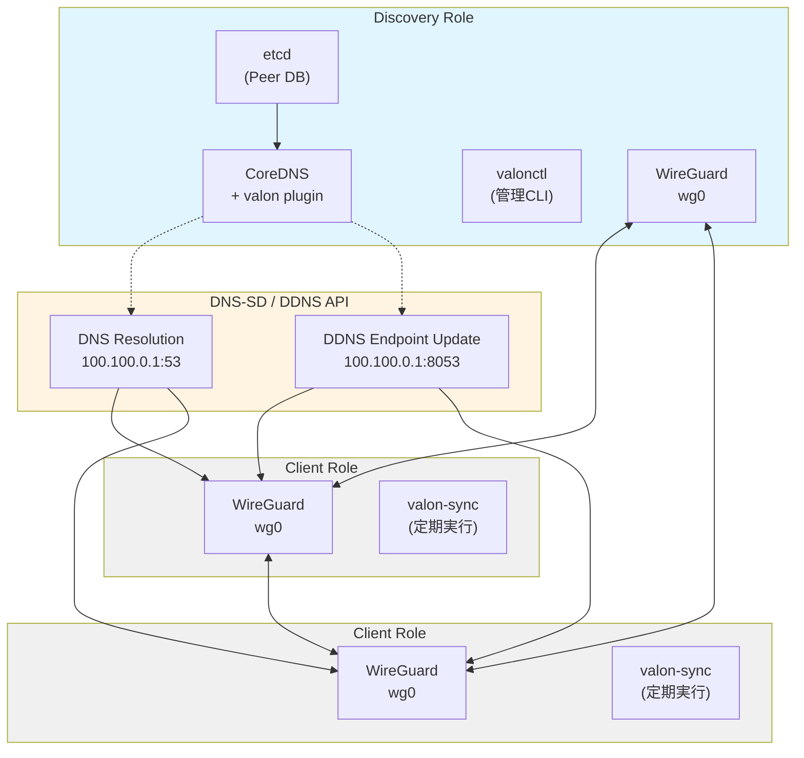

# VALON - Virtual network based Adaptive to connections Logical Overlay NetWork

**仮想ネットワークを利用した多様な接続環境に対応する論理構成によるオーバレイネットワーク**

WireGuard ベースの動的 VPN ネットワークシステム。DNS-SD（DNS Service Discovery）を活用して、Peer のエンドポイント情報を自動的に管理・更新します。

## 概要

VALON は以下の機能を提供します：

- **Discovery Role**: CoreDNS + カスタムプラグインによる DNS-SD サーバー
- **Dynamic DNS (DDNS)**: Peer のエンドポイント情報を HTTP API 経由で更新
- **自動エンドポイント解決**: LAN/NAT 環境に応じて最適なエンドポイントを自動選択
- **管理ツール (valonctl)**: Peer の追加・削除・一覧表示を行う CLI ツール
- **クライアントスクリプト**: エンドポイント同期を自動化する Shell スクリプト群

## アーキテクチャ



## ディレクトリ構成

```
valon/
├── coredns-plugin/valon/   # CoreDNS カスタムプラグイン (Go)
├── valonctl/               # Discovery Role 管理 CLI (Go)
├── client-scripts/         # Client Role スクリプト群 
├── deployments/            # etcd・CoreDNS コンテナ設定 (Podman/Docker)
├── configs/                # 設定ファイル例
└── bin/                    # ビルド済みバイナリ
```

## セットアップガイド

### 1. 前提条件

#### Discovery Role
- Go 1.21+
- etcd 3.5+
- Podman または Docker
- WireGuard
- Root 権限

#### Client Role
- Bash
- WireGuard
- dig コマンド
- Root 権限

### 2. Discovery Role のセットアップ

#### 2.1. WireGuard インターフェースの作成（最初に実行）

**重要**: CoreDNS起動前にWireGuardインターフェースが必要です。

```bash
# 秘密鍵生成
wg genkey | tee /etc/wireguard/wg0.key | wg pubkey > /etc/wireguard/wg0.pub

# /etc/wireguard/wg0.conf を作成
cat <<EOF | sudo tee /etc/wireguard/wg0.conf
[Interface]
PrivateKey = $(cat /etc/wireguard/wg0.key)
Address = 100.100.0.1/24
ListenPort = 51820
EOF

# インターフェース起動
sudo wg-quick up wg0

# 起動確認
ip addr show wg0
```

#### 2.2. CoreDNS 設定ファイルの準備

```bash
# configs/Corefile を編集（必要に応じて）
cat configs/Corefile.example

# 設定例:
# valon.internal:53 {
#     valon {
#         etcd_endpoints http://127.0.0.1:2379
#         wg_interface wg0
#         ddns_listen 100.100.0.1:8053
#         wg_poll_interval 1s
#         etcd_sync_interval 10s
#     }
#     cache 2
#     log
#     errors
# }
```

#### 2.3. etcd + CoreDNS の起動（Podman Compose）

```bash
cd deployments

# ビルド＋起動（初回はビルドに数分かかります）
sudo podman-compose up -d --build

# または Dockerの場合
sudo docker-compose up -d --build

# ログ確認
sudo podman-compose logs -f

# 動作確認
sudo podman exec valon-etcd etcdctl endpoint health
sudo podman logs valon-coredns
```

**注意**: 
- CoreDNSはホストネットワークモード（`network_mode: host`）で動作します
- wg0インターフェースとWireGuard IPが必要です
- DDNS APIは `100.100.0.1:8053` でリッスンします

詳細は [deployments/README.md](deployments/README.md) を参照。

#### 2.4. valonctl のビルドと設定

```bash
# valonctl ビルド
cd valonctl
go build -o ../bin/valonctl ./cmd

# 設定ファイル作成
sudo mkdir -p /etc/valon
sudo cp ../configs/valonctl.yml.example /etc/valon/valonctl.yml

# 設定を編集
sudo vi /etc/valon/valonctl.yml
```

**valonctl.yml の例:**
```yaml
wireguard:
  interface: wg0
  ip: 100.100.0.1
  endpoint: 192.168.1.100:51820  # Discovery Role の LAN IP
  network: 100.100.0.0/24        # IP 自動割り当て範囲

etcd:
  endpoints:
    - http://127.0.0.1:2379

ddns:
  api_url: http://100.100.0.1:8053
```

### 3. Client の追加

#### 3.1. クライアント側で鍵生成

```bash
# クライアントマシンで実行
wg genkey | tee privatekey | wg pubkey > publickey

# 公開鍵を Discovery Role 管理者に送付
cat publickey
```

#### 3.2. Discovery Role 側で Peer 登録

```bash
# valonctl で Peer を追加（IP は自動割り当て）
sudo /path/to/bin/valonctl peer add <クライアントの公開鍵> --alias client01

# 出力例:
# Auto-allocating IP address...
#   Allocated IP: 100.100.0.2
# Adding peer to WireGuard interface wg0...
# Registering peer in etcd...
# ✓ Successfully added peer ... (alias: client01, IP: 100.100.0.2)
#
# === WireGuard Configuration for Client ===
#
# Save this as /etc/wireguard/wg0.conf on the client:
#
# [Interface]
# Address = 100.100.0.2/24
# PrivateKey = <INSERT_YOUR_PRIVATE_KEY_HERE>
# MTU = 1420
#
# [Peer]
# # Discovery Role
# PublicKey = <Discovery Role の公開鍵>
# Endpoint = 192.168.1.100:51820
# AllowedIPs = 100.100.0.1/32
# PersistentKeepalive = 25
# ==========================================
```

表示された設定をクライアントに送付します。

### 4. Client Role のセットアップ

#### 4.1. クライアントスクリプトのインストール

```bash
cd client-scripts

# スクリプトをインストール
sudo cp -r etc/valon /etc/
sudo cp bin/* /usr/local/bin/
sudo chmod +x /usr/local/bin/valon-*

# 設定ファイルを編集
sudo cp /etc/valon/client.conf.example /etc/valon/client.conf
sudo vi /etc/valon/client.conf
```

詳細は [client-scripts/README.md](client-scripts/README.md) を参照。

#### 4.2. WireGuard 設定と起動

```bash
# Discovery Role から受け取った設定を保存
sudo vi /etc/wireguard/wg0.conf
# PrivateKey を挿入

# インターフェース起動（これでDiscovery Roleに自動接続）
sudo wg-quick up wg0

# 接続確認
ping -c 3 100.100.0.1
dig @100.100.0.1 discovery.valon.internal
```

#### 4.3. 同期の自動化

```bash
# systemd timer をインストール
sudo tee /etc/systemd/system/valon-sync.service << 'EOF'
[Unit]
Description=VALON Sync - Update own endpoint and resolve peer endpoints
After=network-online.target wg-quick@wg0.service

[Service]
Type=oneshot
ExecStart=/usr/local/bin/valon-sync
StandardOutput=journal
StandardError=journal

[Install]
WantedBy=multi-user.target
EOF

sudo tee /etc/systemd/system/valon-sync.timer << 'EOF'
[Unit]
Description=VALON Sync Timer
Requires=valon-sync.service

[Timer]
OnBootSec=30s
OnUnitActiveSec=60s
Unit=valon-sync.service

[Install]
WantedBy=timers.target
EOF

# 有効化
sudo systemctl daemon-reload
sudo systemctl enable valon-sync.timer
sudo systemctl start valon-sync.timer
```

## valonctl コマンド一覧

### Peer 管理

```bash
# Peer 追加（IP 自動割り当て）
sudo valonctl peer add <公開鍵> --alias <エイリアス>

# Peer 追加（IP 手動指定）
sudo valonctl peer add <公開鍵> --alias <エイリアス> --wg-ip 100.100.0.10

# Peer 一覧表示
sudo valonctl peer list

# Peer 削除（公開鍵で指定）
sudo valonctl peer remove <公開鍵>

# Peer 削除（エイリアスで指定）
sudo valonctl peer remove <エイリアス>
```

### システム状態確認

```bash
# 全体の状態確認（WireGuard、etcd、CoreDNS DDNS API）
sudo valonctl status
```

## トラブルシューティング

### Discovery Role

#### CoreDNS が起動しない
```bash
# 設定ファイルの構文チェック
/path/to/bin/coredns -conf /etc/coredns/Corefile -validate

# ポート確認
sudo lsof -i :53
sudo lsof -i :8053
```

#### etcd に接続できない
```bash
# etcd コンテナ状態確認
sudo podman ps
sudo podman logs valon-etcd

# etcd 接続テスト
sudo podman exec valon-etcd etcdctl endpoint health
```

#### valonctl がエラーを返す
```bash
# 設定ファイル確認
cat /etc/valon/valonctl.yml

# WireGuard インターフェース確認
sudo wg show wg0

# etcd データ確認
sudo podman exec valon-etcd etcdctl get --prefix /valon/
```

### Client Role

#### valon-bootstrap が失敗する
```bash
# WireGuard インターフェース確認
sudo wg show wg0

# Discovery Role への疎通確認
ping -c 3 192.168.1.100  # Discovery Role の LAN IP

# 設定ファイル確認
cat /etc/valon/client.conf
```

#### valon-sync が動作しない
```bash
# ログ確認
sudo journalctl -u valon-sync.service -f

# 手動実行でデバッグ
sudo valon-sync

# DNS 解決確認
dig @100.100.0.1 lan.client01.valon.internal
```

## 技術仕様

### DNS レコード形式

- **A レコード**: `<alias>.valon.internal` → WireGuard IP
- **LAN A レコード**: `lan.<alias>.valon.internal` → LAN エンドポイント IP
- **NAT A レコード**: `nated.<alias>.valon.internal` → NAT エンドポイント IP
- **SRV レコード**: `_wireguard._udp.<alias>.valon.internal` → ポート情報

### etcd キー構造

```
/valon/
  peers/
    <base64-pubkey>/
      wg_ip          # WireGuard IP (例: 100.100.0.2)
      alias          # エイリアス名 (例: client01)
      lan_endpoint   # LAN エンドポイント (例: 192.168.1.50:51820)
      nat_endpoint   # NAT エンドポイント (例: 203.0.113.10:51820)
  aliases/
    <alias>          # Pubkey への参照
```

### DDNS API

- **Endpoint**: `http://100.100.0.1:8053/api/endpoint`
- **Method**: POST
- **認証**: WireGuard ネットワーク内からのアクセスのみ許可
- **ペイロード**:
  ```json
  {
    "pubkey": "<base64-encoded-pubkey>",
    "lan_endpoint": "192.168.1.50:51820",
    "alias": "client01"
  }
  ```

## 参考リンク

- [WireGuard](https://www.wireguard.com/)
- [CoreDNS](https://coredns.io/)
- [etcd](https://etcd.io/)
